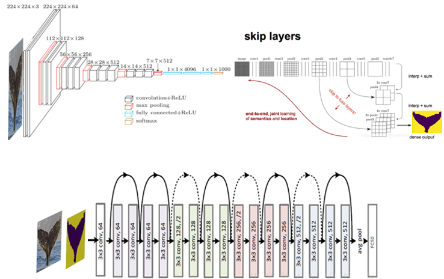

<h1>whale</h1>
<a href="./README_en.md">English</a>|<a href="./README.md">简体中文</a>

<strong>whale是kaggle比赛[鲸鱼图像](https://www.kaggle.com/c/humpback-whale-identification/)识别的简化版，本文是对Top3大神pudae算法复现</strong>

## 描述

为保护濒临灭绝的鲸类资源，1946 年由 15 国政府签署了国际捕鲸公约，我国也在 1980 年成为该公约的成员国。自国际捕鲸公约生效半个多世纪过去了，某些国家以各种理由进行的捕鲸活动仍在继续，鲸鱼种群仍然需要我们的保护。为了帮助保护鲸鱼，科学家们利用监控摄像机观察海面，在鲸鱼出水时拍摄下它们的尾巴。接下来，利用每条鲸鱼尾部不同的纹理图案，来识别鲸鱼的品种以总结鲸鱼族群的变化与移动规律。40 年来，这项工作几乎是用方式、由若干科学家单独完成的，因此遗留下来许多未标记、未利用的数据。

> 来自19年的黑龙江省人工智能大赛

## result

最终验证数据集共有423张图共50类。Acc：0.9713，AUC：0.9985，耗时65s。

## 快速上手

1. 环境安装

> 注意pytorch要单独先安装torch >= 1.7.0
> `pip install -r requirements.txt`

2. 训练
   在fcn目录下执行，训练语义分割模型
   `python train.py`
   在根目录下执行，训练语义分割模型
   `python train.py`

3. 使用模型
   启动本地客户端ui
   `python verify.py`

## 技术路线

### 数据增强

编写Python脚本对数据预处理，并将图片进行分组，数据增强。将数据集进行分组，便于模型搭建和训练，由于数据集稀缺，合理使用数据增强可以提高模型的泛化能力。使用torchvision、Pillow、OpenCV模块对原始数据集数据增强。原图片如图，

数据增强：

- 降噪   采用3*3高斯滤波最优 filter过大图片会模糊；
- 去雾   由于海上拍摄受天气影响，故需要去雾；
- 翻转   翻转后的鲸鱼可以认为是一个新的样本，随机水平翻转；
- 旋转   左右随机旋转10度
- 灰度化 由于很多黑白训练图片，将图片随机灰度化增加训练数据集
- 亮度   由于拍摄角度和时间导致亮度问题，随机按一定阈值调节亮度
- 对比度 对图片的对比度调节
  

### 模型结构

使用FCN语义分割，FCN的卷积网络部分我们采用VGG-19作为前置基础网络，在这些的预训练基础上进行迁移学习与调优，对反卷积的结果跟对应的正向feature map进行叠加输出(这样做的目的是得到更加准确的像素级别分割)。使用FCN语义分割后的mask图形与原来的3通道图片合并，作为四通道输入，传入ResNet18训练分类。模型结构如图

## 模型参数调优过程

这一节中我们将介绍我们是如何经过参数和超参数调优将原来的ResNet18 0.6的准确率，提升到0.89的准确率，训练过程中的加速技巧。

### 模型结构调优

们选定好基础模型后，先修改模型结构，将第一层模型结构 (-1,3,300,300) 修改为(-1,4,300,300)的shape作为输入层，因为新增加了一层FCNmask特征，原来的RGB三通道基础之上加一层，故一共有四个通道作为输入层。
重写全连接层，因为原有模型是分为1000类，不适合本赛题需求，故我们修改了全连接层，最后分为50类。
我们尝试修改中间的卷积层层数，卷积核的大小，模型都没有提升，准确率还下降了不少。经过我们的研究发现，我们使用的预训练权重值，对改动较大的网络不再适用。

### 使用预训练模型

不使用预训练模型如图左，使用预训练模型如图右。

使用预训练模型能极大节省训练时间。如果不使用迁移学习的思想，训练几天也训练不出如此高准确率的网络，训练过程中需要设置运行前向传播参数更新，如果一昧使用原始参数，只训练全连接参数，模型的准确率只能达到0.7左右，最终还是选择重新训练一个新模型。

### 图片输入的Size

送入模型的Size大小也决定着模型的准确率，我们尝试过512*512的作为图片输入的大小，训练时间也大幅度增加了，模型的准确率却只有0.52。使用256*256的模型准确率为0.73，由于许多鲸鱼尾巴图片都长大于宽度，我们选用512*256作为图片输入大小模型准确率提升到0.77，我们又尝试400*400的准确率为0.76,300*300的准确率提升到了0.80，即我们最终使用的输入Size大小。

### 模型的BatchSize

BatchSize的大小决定模型梯度下降的方向，BatchSize越大模型梯度下降的方向越准确，所以我们希望将BatchSize调大，但由于GPU内存不够，我们最大调到了BatchSize=20。

### 学习率

学习率决定着梯度下降的速度，我们尝试将学习率调小，就需要更多的训练模型的时间，使用更大的学习率，测试准确率就得不到提高，经过权衡之下我们选择0.001作为本次模型的初始学习率。

###  梯度下降方式

开始我们使用SGD（随机梯度下降优化器）梯度下降的速度较快，但出现了损失值为nan 的情况，之后又改为Adma优化算法，能自动调整学习率大小。

### 数据增强方式

开始我们在数据预处理脚本中增加了数据增强 ，使用这种方式，会生成大量图片，严重浪费磁盘空间和读取时间。因此我们将数据增强与模型训练代码合成到一起。每次加载同样的数据，在进行数据增强变化，再送入到模型中去训练。这样可以进一步增强模型的鲁棒性、和适应性。

### 训练内存优化

开始我们边测试边加载数据集，优化后是开始训练时，一次性将所有测试数据集加载到内存中并转换为tensor，这样能减少重复加载数据，一定程度上减少训练模型的时间。由于测试数据集需要数据增强，所以没有一次性加载到内存中。

## 遇到的问题

### 在数据预处理过程中出现PIL、CV2、tensor相互转换问题

经过不断的调试我们发现，PIL与CV2和图片的shape完全一样，后我们将他们转换为numpy观察原始数据发现，两种数据格式的3通道排序恰好相反，我们将通道按照合理格式排序后便可以正常转换。

### 训练数据过程中模型不拟合问题

在搭建初级模型中，我们出现了数据拟合，测试数据集的准确率始终为0，开始我们一直怀疑是模型的问题，我们有简单搭建了其他模型，发现都会出现同样的问题，我们有开始怀疑是数据集的问题，我们不断观察数据集，发现每一个分类的数据确实有相同的数据特征。接着开始怀疑自己的标签问题，通过观察csv文件的标签，确实是csv标签的问题，检查代码发现，生成label标签的变量写错了，修改后即解决。

### 数据类型的转换问题

Tensor、numpy的数据类型转换，要注意他们的类型、维度，必要时将他们转换成列表数据逐个观察。

### GPU上tensor取不出问题

`output.cpu().detach() `使用detach截断反向传播的梯度流、不使用这个GPU的tensor取不出来。

### 模型过大问题

理论上使用ResNet模型层数越高，模型越复杂，模型分类的效果越好。由于我们受限于工作站硬件配置，优化过许多更为高级的模型，但效果仍然不够理想

## 优化方向

鲸鱼尾巴的位置和大小都不固定，这可能是影响准确率的原因之一,所以有下面几个优化方向

- [ ] 加入attention机制 让模型自己去寻找尾巴的位置，提高识别准确率；
- [ ] 训练自动定位box的模型，如YOLO3, Faster RCNN等；
- [ ] 训练组合模型，将VGG，RESNET，inceptionv3经过我们的数据集预训练后，再组成一张大网络训练。

## 贡献

欢迎PRs！如果你想为这个项目做贡献，你可以提交pr或issue，[优化方向](#优化方向)中有一些可以扩展的功能。我很高兴看到更多的人参与改进并优化它。