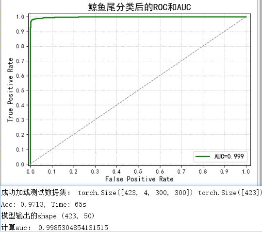
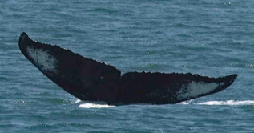
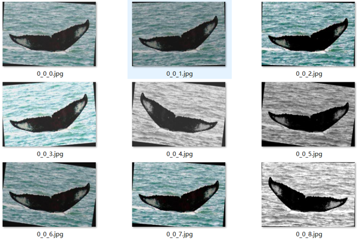
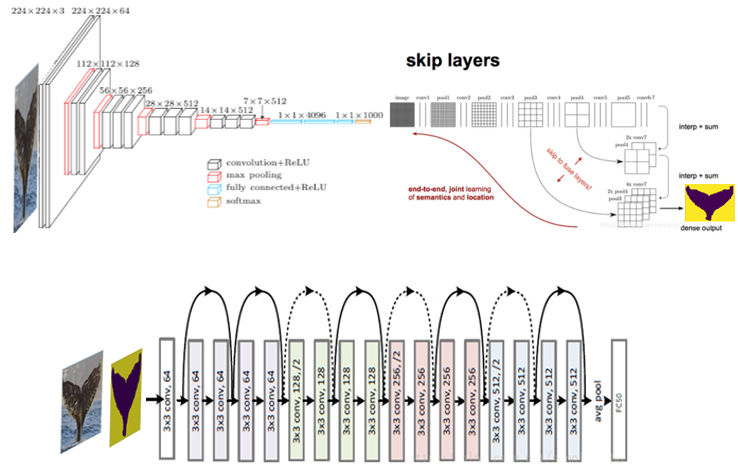
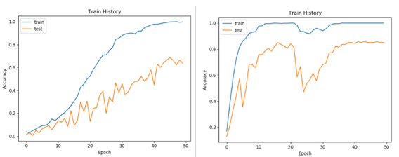

<h1>whale</h1>
<a href="./README_en.md">English</a>|<a href="./README.md">简体中文</a>

<strong>whale是kaggle比赛[鲸鱼图像](https://www.kaggle.com/c/humpback-whale-identification/)识别的简化版，本文是对Top3大神pudae算法复现的</strong>

## Description
In order to protect the endangered cetacean resources, the International Whaling Convention (IWC) was signed by 15 governments in 1946, and our country became a member of the Convention in 1980. More than half a century since the IWC came into force, whaling by certain countries for various reasons continues, and whale populations still need our protection. To help protect the whales, scientists use surveillance cameras to watch the surface and photograph the tails of the whales as they emerge from the water. Next, the different texture patterns on each whale's tail are used to identify the whale species in order to summarize the changes and movement patterns of the population. 40 years of this work has been done almost exclusively by a number of scientists in a way that has left a lot of unmarked, unused data.
> from the Heilongjiang Artificial Intelligence Competition '19

## result

The final validation dataset has 423 graphs with 50 classes. acc: 0.9713, AUC: 0.9985, time 65s.

## Quick start

1. Environment installation
> Note that pytorch has to be installed separately first with torch >= 1.7.0
> `pip install -r requirements.txt`

2. Training
Execute in the fcn directory to train the semantic segmentation model
`python train.py`
Execute in the root directory to train the semantic segmentation model
`python train.py` 4.

4. Use the model
Start the local client ui
`python verify.py`
## Technical route
### Data augmentation
Write Python scripts to pre-process the data and group the images for data augmentation. Grouping the dataset facilitates model building and training. Due to the scarcity of dataset, reasonable use of data augmentation can improve the generalization ability of the model. The original dataset data is data enhanced using torchvision, Pillow, and OpenCV modules. The original image is shown in Fig.

Data enhancement:

- Noise reduction Using 3*3 Gaussian filter optimal filter too large picture will be blurred;
- defogging Defogging is needed because the sea shot is affected by the weather;
- Flip The flipped whale can be considered as a new sample, randomly flipped horizontally;
- Rotate Randomly rotate left and right by 10 degrees
- Grayscale Due to many black and white training images, grayscale the images randomly to increase the training data set
- Brightness Randomly adjust the brightness by a certain threshold due to the angle and time of shooting
- Contrast Adjust the contrast of the images

### Model structure
Using FCN semantic segmentation, we use VGG-19 as the front base network for the convolutional network part of FCN, and perform migration learning and tuning on the basis of these pre-training, and superimpose the output of the deconvolution results with the corresponding forward feature map (the purpose of doing so is to get more accurate pixel-level segmentation). The FCN semantic segmented mask graph is merged with the original 3-channel image as a 4-channel input and passed into ResNet18 for training and classification. The model structure is shown in Fig.

## Model parameter tuning process
In this section, we will describe how we improved the original ResNet18 accuracy of 0.6 to 0.89 after parameter and hyperparameter tuning, and the acceleration techniques during training.
### Model structure tuning
After we selected the base model, we first modified the model structure, the first layer of the model structure (-1,3,300,300) was modified to (-1,4,300,300) shape as the input layer, because the new layer of FCNmask features, the original RGB three channels based on the addition of a layer, so there are four channels as the input layer.
We rewrite the fully-connected layer because the original model is divided into 1000 classes, which is not suitable for the requirements of this competition, so we modify the fully-connected layer and finally divide it into 50 classes.
We tried to modify the number of layers in the middle convolutional layer and the size of the convolutional kernel, but the model did not improve, and the accuracy rate also decreased a lot. After our research, we found that the pre-trained weight values we used are no longer applicable to the network with large modifications.
### Using the pre-trained model
Without the pre-trained model is shown on the left, and with the pre-trained model is shown on the right.

Using a pre-training model can save a lot of training time. If we do not use the idea of migration learning, we cannot train such a high accuracy network for several days. The training process needs to be set to run forward propagation parameter updates, and if we ignore the original parameters and only train the fully connected parameters, the accuracy of the model can only reach about 0.7, and we eventually choose to retrain a new model.

### Size of the image input
The size of the input model also determines the accuracy of the model, we tried 512*512 as the image input size, the training time also increased significantly, but the accuracy of the model is only 0.52. The accuracy of the model using 256*256 is 0.73, because many whale tail images are longer than the width, we choose 512*256 as the image input size model The accuracy was increased to 0.77, we tried 400*400 with an accuracy of 0.76, and 300*300 with an accuracy of 0.80, which is the size of the input size we finally used.
### BatchSize of the model
The size of BatchSize determines the direction of gradient descent of the model, the larger the BatchSize the more accurate the direction of gradient descent of the model, so we want to adjust the BatchSize larger, but due to the lack of GPU memory, we adjusted the maximum to BatchSize=20.
### Learning rate
The learning rate determines the speed of gradient descent. If we try to make the learning rate smaller, we need more time to train the model, and if we use a larger learning rate, the test accuracy will not be improved, so we choose 0.001 as the initial learning rate for this model.
### Gradient descent method
At first we used SGD (Stochastic Gradient Descent Optimizer) for faster gradient descent, but the loss value of nan occurred, and then we changed to Adma optimization algorithm, which can automatically adjust the learning rate size.
### Data enhancement method
At first we added data augmentation to the data preprocessing script , using this approach, a large number of images are generated, which seriously wastes disk space and read time. So we synthesized the data augmentation and model training code together. The same data is loaded each time, and then fed into the model for training after the data augmentation changes. This can further enhance the robustness, and adaptability of the model.

### Training memory optimization
At first, we load the dataset while testing, and then optimize it by loading all the test dataset into memory and converting it to tensor at once when we start training, which can reduce the repeated loading of data and reduce the time to train the model to some extent. Since the test datasets need data augmentation, they are not loaded into memory at once.

## Optimization direction
The location and size of the whale tail are not fixed, which may be one of the reasons to affect the accuracy rate, so there are several optimization directions as follows
- [ ] Add attention mechanism to let the model find the location of the tail by itself to improve the recognition accuracy;
- [ ] Train models for automatic location box, such as YOLO3, Faster RCNN, etc;
- [ ] Train the combined model, VGG, RESNET, inceptionv3 will be pre-trained by our dataset and then form a big network for training.

## Contribute
PRs are welcome! If you want to contribute to this project, you can submit a pr or issue, and there are some features in [Optimization direction](#Optimization direction) that can be extended. I'm happy to see more people involved in improving and optimizing it.